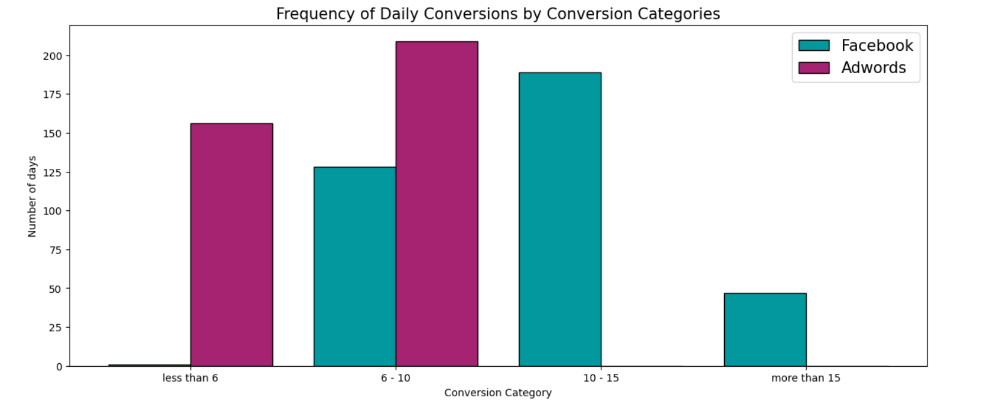
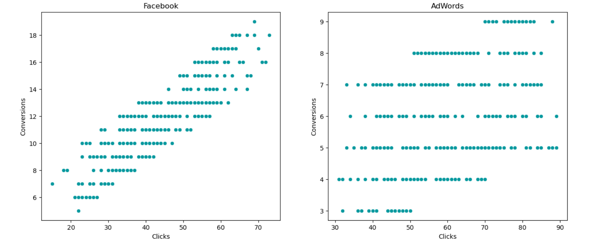
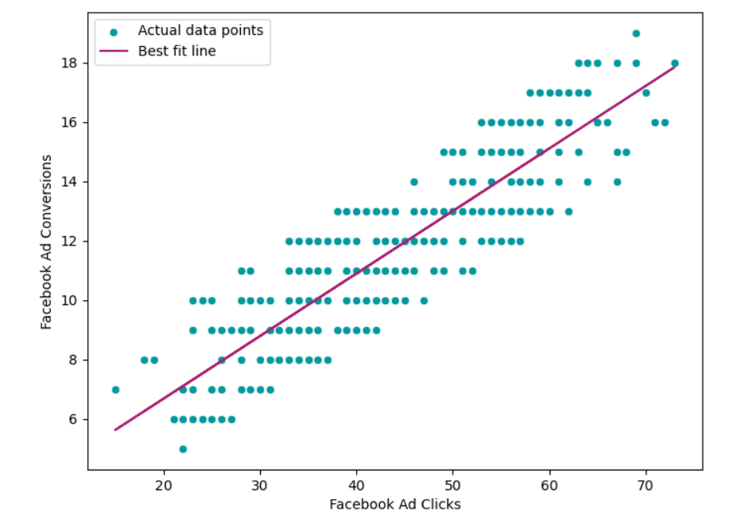
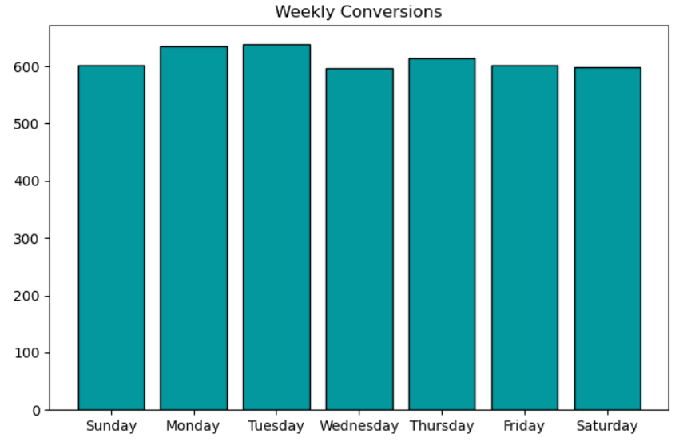
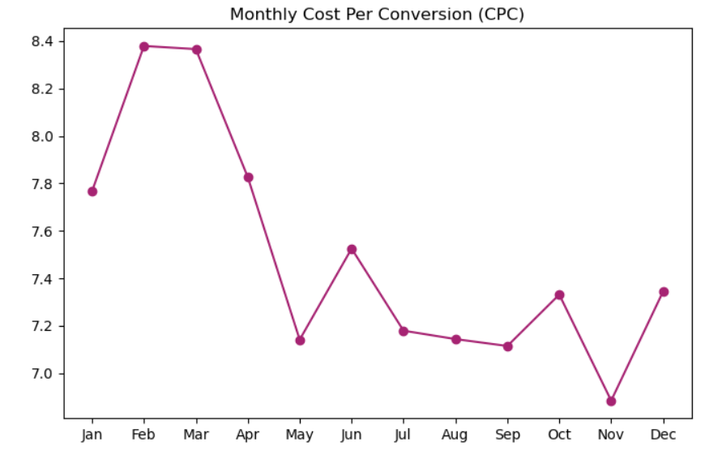

# Media Spend ROI Analysis — Facebook vs Google Ads

A data-driven analysis of two advertising campaigns (Facebook & Google Ads) to determine which platform delivers better ROI in terms of clicks, conversions, and cost-effectiveness.

> **Note:** The dataset uses the legacy name "AdWords" (Google rebranded AdWords to Google Ads in 2018). The analysis and findings apply directly to Google Ads.

---

## Business Problem

A marketing agency needs to decide where to allocate its advertising budget — **Facebook Ads** or **Google Ads**. Using 365 days of campaign data from 2019, this project identifies the more effective platform through statistical analysis and machine learning.

> **Research Question:** Which ad platform is more effective in terms of conversions, clicks, and overall cost-effectiveness?

---

## Dataset

| Feature | Description |
|---|---|
| Date | Jan 1, 2019 – Dec 31, 2019 (365 rows) |
| Ad Views | Number of times the ad was seen |
| Ad Clicks | Number of clicks on the ad |
| Ad Conversions | Number of purchases/actions after clicking |
| Cost per Ad | Daily cost of running the campaign |
| CTR | Click-Through Rate = Clicks ÷ Views |
| Conversion Rate | Conversions ÷ Clicks |
| CPC | Cost Per Click = Ad Cost ÷ Clicks |

---

## Tech Stack


```
pandas · numpy · matplotlib · seaborn · scipy · sklearn · statsmodels
```

---

## Analysis Overview

### 1. Exploratory Data Analysis (EDA)

Distribution of Facebook Ad Clicks and Conversions — both show a roughly symmetrical shape with no major outliers.


---

### 2. Conversion Category Comparison

Facebook dominates in higher conversion ranges (10–15 and 15+), while Google Ads stays stuck in the lower ranges (less than 6 and 6–10).



---

### 3. Correlation Analysis — Do clicks lead to conversions?

Facebook shows a strong upward trend (r = 0.87). Google Ads is much more scattered (r = 0.45), meaning clicks don't reliably lead to conversions.



---

### 4. Linear Regression

Predicting Facebook conversions from clicks — the best fit line confirms a strong linear relationship (R² = 76.35%).



| Clicks | Expected Conversions |
|---|---|
| 50 | ~5.9 |
| 80 | ~8.8 |

---

### 5. Time-Series Analysis

**Weekly:** Monday and Tuesday consistently show the highest conversions.



**Monthly CPC:** May and November are the most cost-effective months. February is the most expensive.



---

### 6. Ad Spend vs Conversions — Long-Term Relationship (Cointegration)

Beyond short-term correlation, an Engle-Granger cointegration test was run on daily ad spend and conversions to check whether the two series move together in a stable, long-run relationship rather than by coincidence.

- **Test:** Cointegration test (`statsmodels.tsa.stattools.coint`)
- **Result:** p-value < 0.05 → **null hypothesis rejected**
- **Interpretation:** Ad spend and conversions share a long-term equilibrium relationship — meaning budget changes have a stable, proportional impact on conversions over time, not just a short-term spike.

---

## Hypothesis Testing (Welch's T-Test, One-Tailed)

- **H0:** μ_Facebook ≤ μ_Google Ads (no difference, or Google Ads performs at least as well)
- **H1:** μ_Facebook > μ_Google Ads (Facebook generates more conversions)

| Metric | Facebook | Google Ads |
|---|---|---|
| Mean Conversions/day | 11.74 | 5.98 |
| T-Statistic | 32.88 | — |
| P-Value | 9.35e-134 | — |
| Result | **Reject H0** | — |

> Facebook delivers statistically significantly more conversions (p << 0.05)

---

## Key Findings

- Facebook generates **~2x more conversions** per day than Google Ads (11.74 vs 5.98)
- Facebook clicks are a **strong predictor** of conversions (r = 0.87) vs Google Ads (r = 0.45)
- The conversion gap is **statistically significant** — confirmed via one-tailed Welch's t-test, not due to random chance
- Ad spend and conversions share a **long-term equilibrium relationship** — confirmed via cointegration test
- **May & November** are the most cost-effective months to run Facebook Ads; **February** is the most expensive
- **Monday & Tuesday** consistently see the highest conversions during the week

---

## Recommendation

> Allocate the majority of the advertising budget to **Facebook Ads**, particularly on **Mondays and Tuesdays** during **May and November**, for maximum ROI.

---

## Project Structure

```
media-spend-roi-facebook-vs-google-ads/
│
├── facebook_vs_adwords_ab_analysis.ipynb   # Main analysis notebook
├── marketing_campaign.csv                  # Dataset
├── images/                                 # All plot screenshots
│   ├── histogram.png
│   ├── conversion_categories.png
│   ├── scatter_clicks_conversions.png
│   ├── regression.png
│   ├── weekly_conversions.png
│   └── monthly_cpc.png
├── README.md
└── LICENSE
```

---

## How to Run

```bash
# Clone the repo
git clone https://github.com/aditya-datahub/facebook-vs-adwords-ab-test.git

# Install dependencies
pip install pandas numpy matplotlib seaborn scipy scikit-learn statsmodels

# Open the notebook
jupyter notebook facebook_vs_adwords_ab_analysis.ipynb
```

---

## Connect

**Aditya Sharma** — [GitHub](https://github.com/aditya-datahub) · [LinkedIn](https://www.linkedin.com/in/aditya-sharma-data-analyst/)
